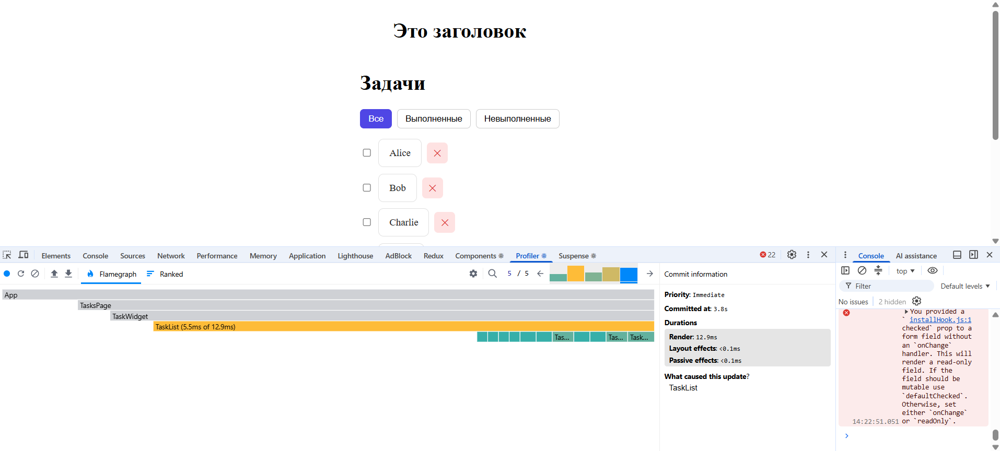
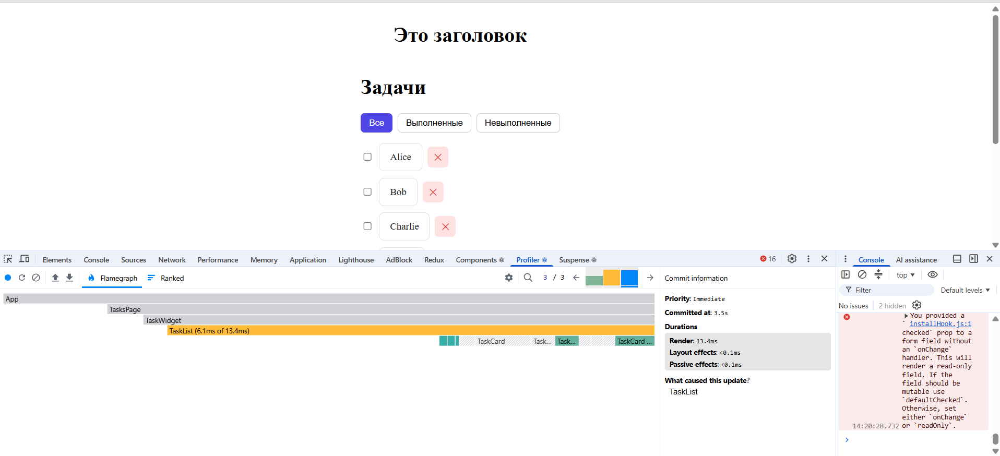

# LESSON-2 — Оптимизация: `React.memo`, `useMemo`, `useCallback`

Ветка: `lesson-2`

## Запуск

```bash
npm ci
npm run dev      # http://localhost:5173
npm run build    # прод-сборка
npm run lint     # ESLint
```

## Чеклист

- [x] **`TaskCard` через `React.memo`** — 3 балла
  - [x] Компонент обёрнут в `React.memo`
  - [x] Не перерисовывается без изменения props
  - [x] Код чистый
- [x] **`useMemo` для фильтрации** — 3 балла
  - [x] Фильтрация в `useMemo` с зависимостями `[tasks, filter]`
  - [x] UI обновляется корректно
  - [x] Граничные случаи (пустой список, одна задача, удаление, toggle) — ОК
- [x] **`useCallback` для функций** — 3 балла
  - [x] `removeTask` и `toggleTask` в `useCallback` с `[]`
  - [x] Ссылки стабильны, передаются в props
  - [x] Поведение не ломается
- [x] **Бонус: Profiler** — 3 балла
  - [x] Скриншот Profiler после интеракций
  - [x] Комментарии к скриншоту
  - [x] Анализ 2+ компонентов

**Итого: 12 / 12 баллов.**

## Что сделано

### 1. `React.memo` для `TaskCard`

`src/entities/task/ui/TaskCard.tsx` — компонент обёрнут в `React.memo`, задан `displayName`. Карточка не перерисовывается, если `task`, `onRemove`, `onToggle` не изменились.

### 2. `useMemo` для фильтрации

`src/features/taskList/model/useTasks.ts` — отфильтрованный массив считается через `useMemo` с зависимостями `[tasks, filter]`.

- Пересчёт только при смене `tasks` или `filter`.
- При `filter === 'all'` возвращается та же ссылка — лишний массив не создаётся.
- Удаление / toggle создают новые массивы → `useMemo` не «запоминает» устаревшие данные.
- Проверены граничные случаи: пустой список, одна задача.

### 3. `useCallback` для функций

`src/features/taskList/model/useTasks.ts` — `removeTask` и `toggleTask` обёрнуты в `useCallback` с пустым массивом зависимостей. Внутри используются функциональные обновления `setTasks((prev) => ...)`. Ссылки стабильны → `React.memo` на `TaskCard` работает.

### Бонус. Profiler

Профилировал: смена фильтра, удаление, toggle. Скриншот + комментарии приложены.




**Наблюдение 1 — `TaskCard`:** при удалении задачи перерисовывается только удаляемая карточка, остальные — серые. Причина — стабильные `onRemove`/`onToggle` из `useCallback` + `React.memo`.

**Наблюдение 2 — `TaskList`:** перерисовывается при смене фильтра (ожидаемо — меняется `filteredTasks`). Дочерние карточки вне нового списка не рендерятся. `useMemo` убрал лишние пересчёты.

**Что улучшили:** убрали лишние перерисовки карточек и пересчёты фильтра.
**Что осталось:** проверить `React.memo` на `TaskCard`; при росте — мемоизировать тяжёлые вычисления в `TaskList`.

## Проверка

```bash
npx tsc --noEmit   # без ошибок
npx eslint .       # без ошибок
npm run build      # успешно
```

UI: фильтры переключают список, удаление/toggle работают, устаревшие данные не «залипают».
